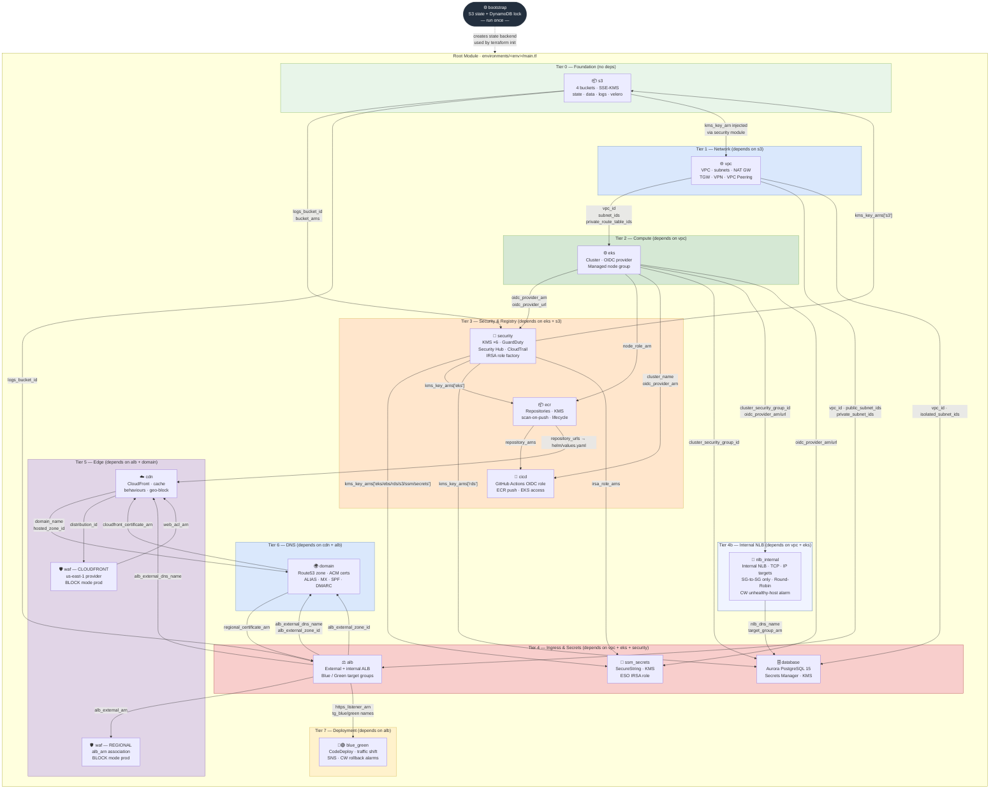

# 🟠 AWS EKS Enterprise Platform

Production-grade, multi-environment AWS infrastructure built with Terraform — 13 modules, 3 environments (dev/staging/prod), GitHub Actions CI/CD with OIDC auth, ArgoCD GitOps, and OPA/conftest policy gates.

---

## Architecture

> **Interactive diagram**: open [`docs/aws-eks-architecture.drawio`](docs/aws-eks-architecture.drawio) in [draw.io / diagrams.net](https://app.diagrams.net) for the full annotated diagram with all layers, service icons, and traffic flows.

```mermaid
flowchart TD
    Users(["👥 Users / Clients"])

    subgraph EXT["External Layer (Global)"]
        R53["🟣 Route 53\nDNS + ALIAS records\nMX / SPF / DMARC"]
            CF["🟣 CloudFront CDN\nHTTPS-only · response headers policy\nHSTS · X-Frame · nosniff · CSP · Permissions-Policy"]
        WAFCF["🔴 WAF v2\nCLOUDFRONT scope\nBot Control · Linux/Unix · rate-limit 2000/5min\nFORWARDED_IP aggregation"]
        ACM_CF["🔴 ACM Certificate\nus-east-1 (for CloudFront)"]
    end

    subgraph VPC["VPC  10.20.0.0/16  —  3 Availability Zones"]
        subgraph PUB["Public Subnets"]
            IGW["🟣 Internet Gateway"]
            NAT["🟣 NAT Gateways\n×3 prod · ×1 dev/staging"]
            ALB["🟠 External ALB\nTLS 1.3 · CF prefix list only\nX-CloudFront-Secret enforcement · 403 default\ndrop_invalid_header_fields"]
            WAFR["🔴 WAF v2 REGIONAL\nBot Control · Linux/Unix · SQLi · CRS\nFORWARDED_IP rate-limit"]
            ACM_R["🔴 ACM Certificate\nregional (for ALB)"]
        end

        subgraph PRIV["Private Subnets — EKS Nodes"]
            EKS["🟠 EKS Cluster\nK8s 1.30 · etcd Secrets encrypted (KMS)\nPrivate endpoint (prod) · Pod Identity"]
            NODES["🟠 Managed Node Group\nm5.xlarge ON_DEMAND prod\nt3.medium SPOT dev"]
            ARGO["🟣 ArgoCD\napp-of-apps GitOps"]
            ESO["🔴 External Secrets Operator\nsyncs SSM → K8s Secrets"]
            CD["🔴 CodeDeploy\nBlue/Green · Linear traffic shift"]
            TGW["🟣 Transit Gateway\nhub-and-spoke routing"]
            VPN["🟣 VPN Gateway + CGW\nSite-to-Site IPSec/BGP"]
            PEER["🟣 VPC Peering\ncross-account"]
        end

        subgraph ISO["Isolated Subnets — Data"]
            AURORA["🔴 Aurora PostgreSQL 15\nwriter + reader · KMS encrypted\nIAM auth · log_statement=all\n35-day backup retention (prod)"]
            SM["🔴 Secrets Manager\nDB credentials JSON"]
        end
    end

    subgraph SVCR["AWS Managed Services"]
        ECR["🟠 ECR\nfrontend · backend\nIMMUTABLE tags · KMS · scan-on-push"]
        S3["🟢 S3 Buckets ×4\nstate · data · logs · velero\nSSE-KMS · lifecycle · Object Lock COMPLIANCE (logs+state)"]
        SSM["🔴 SSM Parameter Store\nSecureString · KMS\nESO pulls via IRSA"]
        KMS["🔴 KMS Keys ×6\neks · ebs · rds · s3 · ssm · secrets"]
        GD["🔴 GuardDuty\nS3 + K8s audit + malware\nSNS alerts severity ≥ HIGH"]
        SH["🔴 Security Hub\nCIS v1.4 + AWS Foundational"]
        CT["🔴 CloudTrail\nmulti-region (prod) → S3 + CWLogs"]
        CW["🔴 CloudWatch\nalarms · rollback triggers"]
        SNS["🔴 SNS\ndeploy notifications"]
    end

    subgraph CICD["CI/CD — GitHub Actions (OIDC · no static keys)"]
        direction LR
        V["1 · tf validate\n+ tflint"] --> O["2 · conftest\nOPA policies"] --> P["3 · tf plan\nPR comment"] --> D["4 · apply dev\nauto"] --> S["5 · apply staging\n1 reviewer"] --> PR["6 · apply prod\nSRE approval"]
    end

    ONPREM[["🏢 On-Premises\n/ Other AWS Accounts"]]

    %% Traffic flow
    Users -->|DNS| R53
    R53 -->|ALIAS| CF
    WAFCF -.->|protects| CF
    ACM_CF -.->|TLS| CF
    CF -->|HTTPS origin| ALB
    WAFR -.->|protects| ALB
    ACM_R -.->|TLS| ALB
    ALB -->|HTTP| EKS
    EKS --- NODES
    NODES -->|5432| AURORA
    AURORA --- SM
    ECR -.->|pull images| NODES
    ESO -.->|pull secrets| SSM
    SSM -.->|KMS decrypt| KMS
    CD -.->|blue/green shift| ALB
    CD -.->|notify| SNS
    CW -.->|rollback alarm| CD
    TGW -->|hub-and-spoke| ONPREM
    VPN -.->|IPSec/BGP| ONPREM
    PEER -.->|peering| ONPREM
    CICD -.->|OIDC · push images| ECR
    CICD -.->|OIDC · kubectl| EKS
    CT -->|logs| S3
    GD & SH & CT --- KMS

    %% Styles
    classDef compute fill:#FF9900,stroke:#FF9900,color:#fff
    classDef network fill:#8C4FFF,stroke:#8C4FFF,color:#fff
    classDef security fill:#DD344C,stroke:#DD344C,color:#fff
    classDef storage fill:#569A31,stroke:#569A31,color:#fff
    classDef cicdstyle fill:#5835CC,stroke:#5835CC,color:#fff
    class EKS,NODES,ALB,ECR compute
    class R53,CF,IGW,NAT,TGW,VPN,PEER,ARGO network
    class WAFCF,WAFR,ACM_CF,ACM_R,GD,SH,CT,CW,SNS,ESO,CD,KMS,SM,SSM,AURORA security
    class S3 storage
    class V,O,P,D,S,PR cicdstyle
```



**Module dependency chain:**
```
s3 + security ──→ vpc ──→ eks ──→ alb ──→ cdn
                       ↘ database, ecr, domain, waf
                       ↘ nlb_internal (sits between eks + database)
                                 ↘ blue_green (wires ALB target groups)
                   cicd (wires ecr + eks ARNs)
                   ssm_secrets (wires security KMS + EKS OIDC)
```

---

## Terraform Hierarchical Architecture

### Directory Hierarchy

```
aws-eks-enterprise-platform/
│
├── terraform/
│   │
│   ├── bootstrap/                     ← Layer 0 · Run once manually
│   │   └── main.tf                      Creates S3 state buckets + DynamoDB lock
│   │                                    tables per environment (KMS encrypted)
│   │
│   ├── environments/                  ← Layer 1 · Root modules (one per env)
│   │   ├── dev/
│   │   │   ├── main.tf                  Wires all 13 child modules together
│   │   │   ├── variables.tf             All env-specific knobs
│   │   │   ├── backend.hcl.example      S3 backend config template
│   │   │   └── terraform.tfvars.example Safe-to-copy secrets template
│   │   ├── staging/                     Same structure, different defaults
│   │   └── prod/                        Same structure + TGW/VPN/HA enabled
│   │
│   └── modules/                       ← Layer 2 · Reusable child modules
│       ├── vpc/                         Network foundation — must apply first
│       ├── s3/                          State buckets — applied before security
│       ├── security/                    KMS + GuardDuty + IRSA factory
│       ├── eks/                         Cluster + OIDC provider
│       ├── ecr/                         Container registries
│       ├── alb/                         Load balancer + target groups
│       ├── cdn/                         CloudFront distribution
│       ├── waf/                         WAFv2 (called twice: CF + regional)
│       ├── domain/                      Route53 + ACM certs
│       ├── database/                    Aurora PostgreSQL
│       ├── nlb_internal/                Internal NLB — EKS → DB tier
│       ├── ssm_secrets/                 Parameter Store + ESO IRSA
│       ├── cicd/                        GitHub Actions OIDC role
│       └── blue_green/                  CodeDeploy deployment group
│
├── policies/
│   └── terraform.rego                 ← OPA rules — conftest runs these in CI
│
└── .github/workflows/
    ├── terraform.yml                  ← 6-job CI gate (validate→plan→apply)
    └── build.yml                      ← Docker build + ECR push + GitOps tag
```

---

### Module Dependency Graph

Each arrow shows a Terraform `output → input` dependency — modules lower in the graph consume outputs from modules above them.



---

### Module Output → Input Wiring

The table below shows exactly which module outputs are consumed as inputs by other modules — this is the wiring implemented in each `environments/<env>/main.tf`.

| Producer module | Output | Consumed by | Input variable |
|-----------------|--------|-------------|----------------|
| `s3` | `logs_bucket_id` | `security` | `cloudtrail_s3_bucket` |
| `s3` | `bucket_arns["logs"]` | `waf_regional` | `s3_logs_bucket_arn` |
| `s3` | `logs_bucket_domain_name` | `cdn` | `s3_logs_bucket` |
| `s3` | `logs_bucket_id` | `alb` | `access_logs_bucket` |
| `vpc` | `vpc_id` | `eks`, `alb`, `database`, `waf_regional` | `vpc_id` |
| `vpc` | `private_subnet_ids` | `eks`, `alb` | `private_subnet_ids` |
| `vpc` | `public_subnet_ids` | `alb` | `public_subnet_ids` |
| `vpc` | `isolated_subnet_ids` | `database` | `isolated_subnet_ids` |
| `eks` | `oidc_provider_arn` | `security`, `ssm_secrets` | `oidc_provider_arn` |
| `eks` | `oidc_provider_url` | `security`, `ssm_secrets` | `oidc_provider_url` |
| `eks` | `node_role_arn` | `ecr` | `node_role_arn` |
| `eks` | `node_role_name` | `ecr` | — (via `node_role_arn`) |
| `eks` | `cluster_name` | `cicd` | `eks_cluster_name` |
| `eks` | `cluster_security_group_id` | `database` | `allowed_security_group_id` |
| `security` | `kms_key_arns["eks"]` | `ecr` | `kms_key_arn` |
| `security` | `kms_key_arns["rds"]` | `database` | `kms_key_arn` |
| `security` | `kms_key_arns["s3"]` | `s3` | `kms_key_arn` |
| `security` | `kms_key_arns["ssm"]` | `ssm_secrets` | `kms_key_arn` |
| `security` | `irsa_role_arns` | `ssm_secrets` | `workload_role_arns` |
| `ecr` | `repository_arns` (all) | `cicd` | `ecr_repository_arns` |
| `ecr` | `github_actions_role_arn` | `ecr` | `ci_role_arn` |
| `cicd` | `github_actions_role_arn` | `ecr` | `ci_role_arn` |
| `alb` | `alb_external_arn` | `waf_regional` | `alb_arn` |
| `alb` | `alb_external_dns_name` | `cdn`, `domain` | `alb_dns_name` |
| `alb` | `alb_external_zone_id` | `domain` | `alb_hosted_zone_id` |
| `alb` | `https_listener_arn` | `blue_green` | `alb_listener_arns` |
| `alb` | `blue_target_group_arn` | `blue_green` | — (by name) |
| `cdn` | `domain_name` | `domain` | `cloudfront_domain_name` |
| `cdn` | `hosted_zone_id` | `domain` | `cloudfront_hosted_zone_id` |
| `waf_cloudfront` | `web_acl_arn` | `cdn` | `waf_web_acl_arn` |
| `domain` | `cloudfront_certificate_arn` | `cdn` | `certificate_arn` |
| `domain` | `regional_certificate_arn` | `alb` | `certificate_arn` |
| `vpc` | `private_subnet_ids` | `nlb_internal` | `private_subnet_ids` |
| `eks` | `cluster_security_group_id` | `nlb_internal` | `eks_node_security_group_id` |
| `nlb_internal` | `nlb_dns_name` | `database` | — (app-layer uses DNS instead of direct Aurora endpoint) |
| `nlb_internal` | `db_security_group_id` | `database` | `allowed_security_group_id` |
| `s3` | `logs_bucket_id` | `nlb_internal` | `access_logs_bucket` (prod only) |

---

### Apply Order & State Isolation

```
terraform/
  bootstrap/          ← independent state (local or pre-existing bucket)
  environments/
    dev/              ← isolated state: s3://eks-enterprise-dev-state/dev/terraform.tfstate
    staging/          ← isolated state: s3://eks-enterprise-staging-state/staging/...
    prod/             ← isolated state: s3://eks-enterprise-prod-state/prod/...
```

Each environment is a **separate Terraform state** — a prod failure cannot corrupt dev state. Within an environment, Terraform resolves the full dependency graph automatically: modules with no pending dependencies are applied in parallel; cyclic dependencies are prevented at plan time.

**First-run order (handled automatically by `terraform apply`):**
```
1. s3                (no deps)
2. vpc               (no deps)
3. eks               (← vpc)
4. security          (← eks + s3)
5. ecr + cicd        (← eks + security)  ← applied in parallel
6. alb + database    (← vpc + eks + security)
7. ssm_secrets       (← security + eks)
8. waf_regional      (← alb)
9. cdn               (← alb)
10. waf_cloudfront   (← cdn)
11. domain           (← cdn + alb)
12. blue_green       (← alb)
13. nlb_internal     (← vpc + eks)
```

---

## Modules

| Module | Description |
|--------|-------------|
| `vpc` | VPC, public/private/isolated subnets (3 AZs), NAT GW, VPC Flow Logs, **VPC Peering**, **Transit Gateway** (hub-and-spoke), **Site-to-Site VPN** (BGP), **subnet-level NACLs** (public/private/isolated) |
| `alb` | External + internal ALB, HTTP→HTTPS redirect, blue/green target groups, TLS 1.3, **ingress restricted to CloudFront managed prefix list**, **`drop_invalid_header_fields`**, **`X-CloudFront-Secret` listener rule** (403 default) |
| `cdn` | CloudFront distribution, static/API cache behaviors, custom error pages, geo-restriction, **response headers security policy** (HSTS · X-Frame-Options · nosniff · Referrer-Policy · Permissions-Policy) |
| `waf` | WAFv2 (CLOUDFRONT + REGIONAL scope), managed rule groups (Common · KnownBadInputs · SQLi · IP Reputation · **Linux** · **Unix**), **Bot Control**, rate-limit via **FORWARDED_IP** (real client IP behind CloudFront), geo-block |
| `domain` | Route53 zone, ACM certs (CloudFront + regional), ALIAS/CNAME/MX/SPF/DMARC records, **`api.domain.com` routes through CloudFront** (WAF coverage on API tier) |
| `eks` | EKS managed cluster, IRSA/OIDC, **Pod Identity addon**, managed node group (SPOT dev, ON_DEMAND prod), core add-ons (`PRESERVE` mode), **etcd Secrets encrypted at rest via KMS** |
| `security` | KMS keys (6 services, **hardened policy**, **multi-region on rds+secrets**), GuardDuty (**S3 export + SNS HIGH-severity alerts**), Security Hub (**CIS v1.4** + AWS Foundational), CloudTrail, IRSA role factory |
| `ecr` | ECR repositories, lifecycle policies, KMS encryption, scan-on-push, node/CI IAM policies |
| `cicd` | GitHub Actions OIDC IAM role — no long-lived keys; ECR push, EKS access, SSM write |
| `blue_green` | CodeDeploy blue/green with ALB traffic shifting, SNS notifications, CloudWatch rollback alarms |
| `s3` | 4 buckets (state/data/logs/velero), SSE-KMS, public-access blocked, HTTPS-only policy, lifecycle rules, **Object Lock COMPLIANCE mode on `logs`+`state`** (tamper-proof, 365-day retention) |
| `database` | Aurora PostgreSQL 15, subnet group, enhanced monitoring, Secrets Manager credentials, KMS encryption, **IAM database auth** (IRSA tokens), **full audit logging** (log_statement=all · connections · disconnections), **no outbound egress** |
| `ssm_secrets` | SSM Parameter Store (SecureString/KMS), read/write IAM policies, External Secrets Operator IRSA role |
| `nlb_internal` | Internal Network Load Balancer between EKS and database tier — IP-based targets, strict SG-to-SG rules, TCP health checks, Round-Robin, CloudWatch unhealthy-host alarm, optional S3 access logs |

---

## Environment Comparison

| Setting | dev | staging | prod |
|---------|-----|---------|------|
| NAT Gateways | 1 (cost saving) | 1 | 3 (one/AZ) |
| EKS nodes | `t3.medium` SPOT | `t3.large` ON_DEMAND | `m5.xlarge` ON_DEMAND |
| EKS endpoint | public+private | public+private | **private only** |
| etcd Secrets encryption | ❌ | ❌ | ✅ KMS |
| WAF mode | COUNT | BLOCK | BLOCK |
| WAF Bot Control | ❌ | BLOCK | BLOCK |
| WAF rate limit | 2000/5min | 2000/5min | 2000/5min (FORWARDED_IP) |
| CF secret enforcement | ❌ | ❌ | ✅ (ALB 403 default) |
| Response headers policy | ✅ | ✅ | ✅ (HSTS · X-Frame · CSP) |
| RDS instances | 1 | 1 | 2 (writer + reader) |
| RDS IAM auth | ✅ | ✅ | ✅ |
| Deletion protection | ❌ | ❌ | ✅ |
| S3 Object Lock | ❌ | ❌ | ✅ COMPLIANCE 365d |
| GuardDuty SNS alerts | ❌ | ❌ | ✅ severity ≥ HIGH |
| Transit Gateway | ❌ | ❌ | ✅ |
| Blue/green routing | AllAtOnce | Linear 50%/5min | Linear 25%/5min |

---

## Quick Start

### 1. Bootstrap (run once)
```bash
cd terraform/bootstrap
terraform init && terraform apply
```

### 2. Configure environment
```bash
cd terraform/environments/dev
cp backend.hcl.example backend.hcl          # fill in bucket/table names
cp terraform.tfvars.example terraform.tfvars # fill in secrets
```

### 3. Deploy
```bash
make ENV=dev init
make ENV=dev plan
make ENV=dev apply
```

Or via CI — push to `develop` for dev auto-apply, push to `main` for staging (1 reviewer) → prod (SRE approval).

---

## GitHub Actions Secrets Required

| Secret | Description |
|--------|-------------|
| `AWS_ROLE_ARN_DEV/STAGING/PROD` | OIDC IAM role ARNs (output from `cicd` module) |
| `TF_BACKEND_DEV/STAGING/PROD` | Path to backend.hcl for each env |
| `DOMAIN_NAME_DEV/STAGING/PROD` | Domain names per env |
| `DB_MASTER_PASSWORD_DEV/STAGING/PROD` | Aurora DB passwords |
| `TF_VAR_cloudfront_origin_secret` | Random secret injected by CloudFront as `X-CloudFront-Secret`; ALB rejects requests without it. Generate: `openssl rand -hex 32`. **Never commit.** |
| `TF_VAR_security_alert_email` | Email for GuardDuty HIGH-severity SNS alerts. Confirm the subscription after first `apply`. |

---

## SSM Secrets

Secrets are stored at `/${name_prefix}/${environment}/<name>` as `SecureString` encrypted with a dedicated KMS key.

In-cluster consumption via [External Secrets Operator](https://external-secrets.io):
```bash
kubectl apply -f kubernetes/secrets/cluster-secret-store.yaml
kubectl apply -f kubernetes/secrets/backend-external-secret.yaml
kubectl get externalsecret -n backend
```

Inject via CI (`TF_VAR_ssm_secrets` JSON):
```json
{
  "db-password": { "value": "...", "description": "Aurora DB password" },
  "jwt-secret":  { "value": "...", "description": "JWT signing secret" }
}
```

---

## Manual Steps After First Apply

1. **Set Route53 nameservers** at your domain registrar: `terraform output name_servers`
2. **Confirm GuardDuty SNS subscription** — AWS sends a confirmation email to `TF_VAR_security_alert_email`; click the link to activate HIGH-severity alerts
3. **Generate and set CloudFront origin secret**: `openssl rand -hex 32` → set as `TF_VAR_cloudfront_origin_secret` CI secret and in each env `terraform.tfvars`
4. **Update ESO role ARN** in `kubernetes/secrets/cluster-secret-store.yaml`: `terraform output -module=ssm_secrets eso_role_arn`
5. **Add GitHub Environments** (dev/staging/production) with reviewer gates in repo Settings → Environments
6. **Set `customer_gateway_ip`** in prod `terraform.tfvars` for Site-to-Site VPN

---

## Security Controls

### Layer 1 — Edge & DDoS
- ✅ **ALB SG restricted to CloudFront managed prefix list** — direct ALB access blocked; WAF perimeter fully enforced
- ✅ **`drop_invalid_header_fields = true`** on ALB — prevents HTTP request smuggling
- ✅ **`X-CloudFront-Secret` ALB listener rule** — ALB returns 403 for any request not originating from CloudFront
- ✅ **CloudFront response headers security policy** — HSTS (max-age=31536000, preload), `X-Frame-Options: DENY`, `X-Content-Type-Options: nosniff`, `Referrer-Policy`, `Permissions-Policy` on every response
- ✅ **WAF FORWARDED_IP rate-limiting** — aggregates on real client IP from `X-Forwarded-For` (was source IP = CloudFront edge nodes)
- ✅ **WAF Bot Control** (BLOCK in prod/staging) — L7 bot flood, credential-stuffing, scraping detection
- ✅ **WAF Linux + Unix managed rule sets** — path traversal (`../../`), shell metacharacter injection
- ✅ **`api.domain.com` routes through CloudFront** — API tier has WAF coverage (was direct-to-ALB with no WAF)
- ✅ **Shield Standard** (free, automatic) provides L3/L4 DDoS absorption at CloudFront and ALB

### Layer 2 — Network
- ✅ **Subnet-level NACLs** on public/private/isolated subnets — independent defence-in-depth from Security Groups
- ✅ **Transit Gateway `auto_accept_shared_attachments = disable`** — requires explicit RAM resource share
- ✅ **VPC Peering `auto_accept = false`** — requires manual security review before acceptance
- ✅ VPC Flow Logs → CloudWatch (ALL traffic)

### Layer 3 — EKS
- ✅ **Kubernetes Secrets encrypted at rest in etcd** via customer-managed KMS key (`eks` key)
- ✅ **`eks-pod-identity-agent` addon** — modern pod credential mechanism alongside IRSA
- ✅ **All addon `resolve_conflicts_on_update = PRESERVE`** — prevents silent destruction of custom CoreDNS/VPC-CNI configs on upgrade
- ✅ **Cluster SG egress scoped** to VPC CIDR (443, 10250, 53) + AWS APIs — was allow-all
- ✅ **`public_access_cidrs` default = `[]`** — deny-by-default if public endpoint is accidentally enabled
- ✅ EKS private endpoint only (prod); control plane logs → CloudWatch

### Layer 4 — IAM / KMS
- ✅ **Hardened KMS key policy** — root has explicit admin actions; data-key usage restricted via `kms:CallerAccount`
- ✅ **`multi_region = true`** on `rds` and `secrets` KMS keys — enables DR cross-region replica
- ✅ **Security Hub CIS v1.4** (upgraded from v1.2.0)
- ✅ **GuardDuty → S3 export + SNS** — HIGH-severity findings trigger email/PagerDuty via EventBridge
- ✅ No IAM access keys — all auth via OIDC (GitHub Actions + EKS IRSA)

### Layer 5 — Database
- ✅ **IAM database authentication** — EKS pods authenticate with short-lived IRSA tokens (no static `master_password` in pods)
- ✅ **Full audit logging** — `log_statement=all`, `log_connections`, `log_disconnections` exported to CloudWatch
- ✅ **DB SG has no egress rules** — Aurora instances cannot initiate outbound connections
- ✅ RDS in isolated subnets, ingress allows 5432 from EKS nodes SG only
- ✅ KMS encrypted, 35-day backup retention (prod), deletion protection

### Layer 6 — Logging & Tamper Protection
- ✅ **S3 Object Lock COMPLIANCE mode** on `logs` and `state` buckets — 365-day retention, cannot be deleted or modified even by root/admin IAM (required for NIST 800-53, SOC 2)
- ✅ CloudTrail multi-region (prod) → S3 + CloudWatch, log file validation enabled
- ✅ KMS encryption on all 6 key types: eks · ebs · rds · s3 · ssm · secrets

### Layer 7 — Policy as Code (OPA)
- ✅ `deny` — ALB without `drop_invalid_header_fields`
- ✅ `deny` — CloudFront in prod without WAF `web_acl_id`
- ✅ `deny` — CloudFront without `response_headers_policy_id`
- ✅ `deny` — EKS with `public_access_cidrs = ["0.0.0.0/0"]`
- ✅ `deny` — RDS in prod without `iam_database_authentication_enabled`
- ✅ `deny` — Internal NLB SG with `0.0.0.0/0` on database ports (IPv4 + IPv6)
- ✅ `deny` — KMS key without rotation, RDS without encryption, EKS without private+public endpoint balance, GuardDuty disabled, ECR scan-off in prod, SSM String for sensitive names, S3 public access

> All OPA checks run in CI at step 2 (`conftest test`) **before** `terraform plan` — a failing policy blocks the pipeline.
