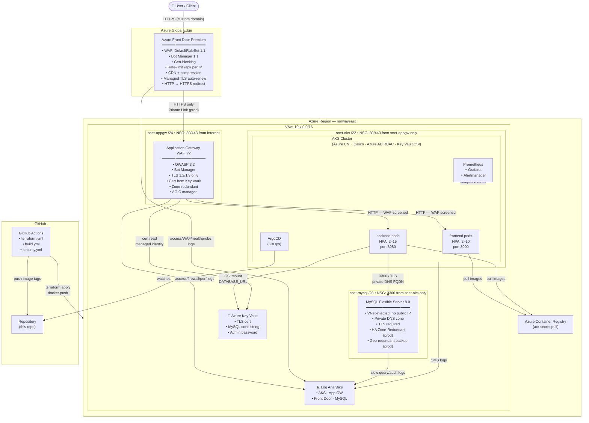

# Azure AKS Enterprise Platform

A production-grade Azure Kubernetes Service (AKS) platform for enterprise-scale freelance and SaaS workloads.  
Built with **Terraform** (modular IaC), **Helm**, **GitOps via ArgoCD**, **Azure Front Door Premium**, **Application Gateway WAF_v2**, **MySQL Flexible Server**, **Azure Cache for Redis**, **Azure Container Registry** (private, geo-replicated), **OpenTelemetry** distributed tracing, **Velero** backup/DR, and **Azure Workload Identity** — all with zero secrets in git.

---

## Table of Contents

1. [Architecture Overview](#architecture-overview)
2. [Traffic Flow](#traffic-flow)
3. [Infrastructure Modules](#infrastructure-modules)
4. [Project Structure](#project-structure)
5. [Environments](#environments)
6. [Prerequisites](#prerequisites)
7. [Quick Start](#quick-start)
8. [GitOps with ArgoCD](#gitops-with-argocd)
9. [CI/CD Pipelines](#cicd-pipelines)
10. [Security](#security)
11. [Monitoring & Alerting](#monitoring--alerting)
12. [Disaster Recovery](#disaster-recovery)
13. [Contributing](#contributing)

---

## Architecture Overview

```
┌─────────────────────────────────────────────────────────────────────────────┐
│                          AZURE GLOBAL EDGE                                  │
│                                                                             │
│   ┌────────────────────────────────────────────────────────────────────┐   │
│   │              Azure Front Door Premium                              │   │
│   │  • Global WAF (DefaultRuleSet 1.1 + Bot Manager 1.1)              │   │
│   │  • Geo-blocking, rate-limiting per IP (/api/ paths)               │   │
│   │  • HTTP → HTTPS redirect                                          │   │
│   │  • CDN: compression, query-string caching                         │   │
│   │  • Managed TLS per custom domain (auto-renews)                    │   │
│   │  • Private Link origin → App Gateway (prod)                       │   │
│   └────────────────────────────┬───────────────────────────────────────┘   │
└────────────────────────────────│────────────────────────────────────────────┘
                                 │ HTTPS only
┌────────────────────────────────▼────────────────────────────────────────────┐
│                        AZURE REGION (norwayeast)                            │
│                                                                             │
│  ┌──────────────────────────────────────────────────────────────────────┐  │
│  │   VNet  10.x.0.0/16                                                  │  │
│  │                                                                      │  │
│  │  snet-appgw /24   ┌──────────────────────────────────────────────┐  │  │
│  │  ┌──────────┐     │  Application Gateway WAF_v2                   │  │  │
│  │  │  NSG     │     │  • OWASP 3.2 + Bot Manager (regional WAF)     │  │  │
│  │  │ 80/443   │────▶│  • TLS termination (cert from Key Vault)      │  │  │
│  │  │ from     │     │  • Zone-redundant (zones 1-2-3)               │  │  │
│  │  │ Internet │     │  • AGIC addon manages backend routing          │  │  │
│  │  └──────────┘     │  • HTTP→HTTPS redirect, TLS 1.2+              │  │  │
│  │                   └───────────────────┬──────────────────────────┘  │  │
│  │                                       │ HTTP (WAF-screened)          │  │
│  │  snet-aks /22     ┌───────────────────▼──────────────────────────┐  │  │
│  │  ┌──────────┐     │  AKS Cluster                                  │  │  │
│  │  │  NSG     │     │  • Azure CNI networking                       │  │  │
│  │  │ 80/443   │     │  • Calico network policy                      │  │  │
│  │  │ from     │────▶│  • Azure AD RBAC                              │  │  │
│  │  │ appgw    │     │  • AGIC ingress controller                    │  │  │
│  │  │ only     │     │  • Key Vault CSI driver                       │  │  │
│  │  └──────────┘     │  • OMS agent → Log Analytics                  │  │  │
│  │                   │                                               │  │  │
│  │                   │  ┌─────────────┐  ┌─────────────┐            │  │  │
│  │                   │  │  frontend   │  │   backend   │            │  │  │
│  │                   │  │  ns         │  │   ns        │            │  │  │
│  │                   │  │  HPA 2-10   │  │  HPA 2-15   │            │  │  │
│  │                   │  └─────────────┘  └──────┬──────┘            │  │  │
│  │                   └──────────────────────────│────────────────── ┘  │  │
│  │                                              │ port 3306             │  │
│  │  snet-mysql /28   ┌──────────────────────────▼──────────────────┐  │  │
│  │  ┌──────────┐     │  MySQL Flexible Server 8.0                   │  │  │
│  │  │  NSG     │     │  • VNet-injected, NO public endpoint          │  │  │
│  │  │ 3306     │────▶│  • Private DNS zone (internal resolution)     │  │  │
│  │  │ from AKS │     │  • TLS required, TLS 1.2/1.3 only            │  │  │
│  │  │ only     │     │  • Slow query log, audit log                  │  │  │
│  │  └──────────┘     │  • Zone-Redundant HA (prod)                  │  │  │
│  │                   │  • Geo-redundant backup (prod)                │  │  │
│  │                   └─────────────────────────────────────────────-┘  │  │
│  │                                                                      │  │
│  │  ┌────────────────────────────────────────────────────────────────┐  │  │
│  │  │  Azure Key Vault                                               │  │  │
│  │  │  • TLS certificate (read by App Gateway managed identity)      │  │  │
│  │  │  • MySQL connection string + admin password                    │  │  │
│  │  │  • Mounted into pods via CSI Secrets Store driver              │  │  │
│  │  └────────────────────────────────────────────────────────────────┘  │  │
│  │                                                                      │  │
│  │  ┌────────────────────────────────────────────────────────────────┐  │  │
│  │  │  Log Analytics Workspace                                       │  │  │
│  │  │  • AKS OMS agent logs                                          │  │  │
│  │  │  • App Gateway: Access, Firewall, Performance logs             │  │  │
│  │  │  • Front Door: Access, WAF, Health probe logs                  │  │  │
│  │  │  • MySQL: Slow query, Audit logs, AllMetrics                   │  │  │
│  │  └────────────────────────────────────────────────────────────────┘  │  │
│  └──────────────────────────────────────────────────────────────────────┘  │
└─────────────────────────────────────────────────────────────────────────────┘
```

---

## Traffic Flow



---

## Infrastructure Modules

### `modules/vnet` — Virtual Network
Provisions the VNet and three dedicated subnets with strict NSGs:

| Subnet | CIDR (dev) | CIDR (prod) | Purpose | NSG |
|--------|-----------|-------------|---------|-----|
| `snet-aks` | `10.10.0.0/22` | `10.20.0.0/21` | AKS node pool | Allow 80/443/8080 from snet-appgw only |
| `snet-appgw` | `10.10.4.0/24` | `10.20.8.0/24` | Application Gateway (dedicated) | Allow 80/443 Internet + GatewayManager |
| `snet-mysql` | `10.10.5.0/28` | `10.20.9.0/28` | MySQL delegated subnet | Allow 3306 from snet-aks only |

### `modules/aks` — AKS Cluster
- Azure CNI networking, Calico network policy, Azure AD RBAC
- System-assigned managed identity
- AGIC addon wired to the Application Gateway
- Log Analytics OMS agent
- Autoscaling node pool (`min` / `max` count)

### `modules/waf` — Application Gateway WAF_v2
- **OWASP 3.2** + **Microsoft Bot Manager 1.0** managed rulesets
- Zone-redundant (zones 1-2-3), autoscale min/max capacity
- TLS 1.2+ only (`AppGwSslPolicy20220101`); certificate read from Key Vault via managed identity
- HTTP → HTTPS permanent redirect
- Custom rules: geo-blocking, API rate-limit (500 req/5 min per IP)
- WAF log scrubbing: strips `Authorization` header and `token` cookies from logs
- `lifecycle.ignore_changes` so AGIC can own routing rules without Terraform conflicts
- Diagnostic logs → Log Analytics (`AccessLog`, `FirewallLog`, `PerformanceLog`)

### `modules/frontdoor` — Azure Front Door Premium
- **DefaultRuleSet 1.1** + **Bot Manager 1.1** global WAF
- Custom rules: geo-blocking, rate-limit on `/api/` (300 req/min prod), bad-UA blocking
- Custom domain management with **auto-provisioned, auto-renewed managed TLS**
- CDN: `UseQueryString` caching, gzip/br compression for HTML/CSS/JS/JSON/SVG
- **Private Link origin** (prod): App Gateway is not reachable from public internet
- HTTP → HTTPS redirect at global edge
- Diagnostic logs → Log Analytics (`AccessLog`, `WAFLog`, `HealthProbeLog`)

### `modules/mysql` — MySQL Flexible Server
- MySQL 8.0, **VNet-injected** — **zero public endpoint**
- Private DNS zone for internal resolution (`<prefix>.mysql.database.azure.com`)
- `require_secure_transport=ON`, TLS 1.2/1.3 only
- Slow query log (>2 s), audit log → Log Analytics
- Auto-grow storage enabled
- Maintenance window: Sunday 02:00
- Connection string + admin password stored in **Key Vault** (never in git or Kubernetes etcd)
- **Kubernetes** consumes via CSI Secrets Store driver → `SecretProviderClass`

| Setting | dev | prod |
|---------|-----|------|
| SKU | `B_Standard_B1ms` | `GP_Standard_D4ds_v4` |
| Storage | 32 GB / 396 IOPS | 128 GB / 6400 IOPS |
| High Availability | off | Zone-Redundant (zones 1+2) |
| Geo-redundant backup | off | on |
| Backup retention | 7 days | 35 days |
| `max_connections` | 100 | 500 |

### `modules/acr` — Azure Container Registry
- **Premium SKU** with geo-replication to `westeurope` (prod) for DR
- `public_network_access_enabled = false` on prod — private endpoint in `snet-aks`
- Private DNS zone `privatelink.azurecr.io` auto-created and linked to VNet
- **AcrPull** role automatically assigned to AKS kubelet identity
- Retention policy: untagged manifests deleted after 30 days
- **Export policy disabled** — prevents image exfiltration to untrusted registries
- **Quarantine policy** (prod): images held until Defender scan passes
- **Microsoft Defender for Containers** enabled on prod subscription
- Diagnostic logs → Log Analytics (repository events, login events)

| Setting | dev | prod |
|---------|-----|------|
| SKU | Standard | Premium |
| Public access | on | off (private endpoint) |
| Geo-replication | off | `westeurope` |
| Quarantine policy | off | on |
| Defender | off | on |

### `modules/redis` — Azure Cache for Redis
- Private endpoint — no public access (`public_network_access_enabled = false`)
- TLS 1.2 only, non-SSL port disabled
- Session/queue offloading prevents state loss during HPA scale-out
- `allkeys-lru` eviction policy (optimal for session cache)
- Connection string + primary key stored in **Key Vault**
- RDB persistence enabled on Premium SKU (prod)

| Setting | dev | prod |
|---------|-----|------|
| SKU | Standard C1 | Premium P1 |
| Zone redundancy | off | zones 1-2-3 |
| Persistence (RDB) | off | on (60 min) |

### `modules/workload_identity` — Azure Workload Identity
- Creates one **User-Assigned Managed Identity** per workload (frontend, backend)
- Establishes **OIDC federated credential** linking Kubernetes `ServiceAccount` to Azure identity
- Assigns **Key Vault Secrets User** role to backend identity — scoped to the Key Vault only
- Outputs `identity_client_ids` for annotating Kubernetes `ServiceAccount` objects
- Replaces the broad kubelet identity model — follows principle of least privilege
- Kubernetes `ServiceAccount` manifests: `kubernetes/rbac/service-accounts.yaml`

### `modules/velero` — Backup & Disaster Recovery
- Dedicated Azure Blob Storage account (GRS on prod, LRS on dev)
- **Workload Identity** authentication — no static credentials in cluster
- OIDC federated credential for `velero/velero-server` service account
- Storage Blob Data Contributor role scoped to backup container only
- Lifecycle policy: tier to cool after 30d, archive after 60d, auto-delete after 90d (prod)
- Install via: `make velero-install ENV=prod`

---

## Project Structure

```
azure-aks-enterprise-platform/
│
├── .devcontainer/
│   ├── devcontainer.json         # VS Code Dev Container (all 7 tools pre-installed)
│   └── setup.sh                  # Post-create: installs gitleaks, velero CLI, argocd CLI, pre-commit
│
├── .gitignore                    # Blocks *.tfstate, *.tfvars, secrets.yaml, *.key, .env, etc.
├── .gitleaks.toml                # Secret scanning rules (Azure keys, SP secrets, kubeconfig)
├── .pre-commit-config.yaml       # Local git hooks: gitleaks, terraform fmt/validate, helmlint
├── Makefile                      # Developer commands: plan, apply, aks-creds, velero-install, etc.
│
├── docs/
│   ├── architecture/             # Architecture diagrams
│   └── screenshots/
│
├── terraform/
│   ├── bootstrap/
│   │   └── main.tf               # One-time: creates Azure Storage for Terraform remote state
│   │
│   ├── modules/
│   │   ├── vnet/                 # VNet + subnets (AKS, AppGW, MySQL) + NSGs
│   │   ├── aks/                  # AKS cluster + OIDC issuer + Workload Identity + AGIC
│   │   ├── waf/                  # Application Gateway WAF_v2 + WAF policy + diagnostics
│   │   ├── frontdoor/            # Front Door Premium + global WAF + custom domains + CDN
│   │   ├── mysql/                # MySQL Flexible Server + private DNS + Key Vault secrets
│   │   ├── acr/                  # Azure Container Registry + private endpoint + geo-replication
│   │   ├── redis/                # Azure Cache for Redis + private endpoint + Key Vault secrets
│   │   ├── workload_identity/    # Per-workload managed identity + OIDC federated credentials
│   │   └── velero/               # Backup storage + Velero workload identity + lifecycle policy
│   │
│   └── environments/
│       ├── dev/
│       │   ├── main.tf           # Dev: all 9 modules wired (Detection WAF, Standard SKUs)
│       │   ├── backend.hcl.example
│       │   └── terraform.tfvars.example
│       ├── staging/
│       │   ├── main.tf           # Staging: prod-equivalent config, smaller scale
│       │   └── backend.hcl.example
│       └── prod/
│           ├── main.tf           # Prod: Prevention WAF, HA MySQL, Premium AFD + ACR, Private Link
│           ├── backend.hcl.example
│           └── terraform.tfvars.example
│
├── kubernetes/
│   ├── frontend/
│   │   ├── namespace.yaml
│   │   ├── deployment.yaml       # HPA 2-10, securityContext, workload identity SA
│   │   └── service.yaml
│   │
│   ├── backend/
│   │   ├── namespace.yaml
│   │   ├── deployment.yaml       # HPA 2-15, CSI-mounted MySQL + Redis secrets
│   │   ├── secret-provider-class.yaml  # CSI SecretProviderClass → Key Vault
│   │   └── secrets.example.yaml
│   │
│   ├── gateway-api/
│   │   └── gateway.yaml          # GatewayClass, Gateway, HTTPRoutes
│   │
│   ├── monitoring/
│   │   ├── namespace.yaml
│   │   ├── prometheus-rules.yaml # 18 alerts: frontend, backend, AKS, WAF, AFD, MySQL
│   │   ├── grafana-dashboard.yaml# 15-panel dashboard (RPS, latency, WAF, AFD, MySQL)
│   │   └── otel-collector.yaml   # OpenTelemetry DaemonSet → Azure Monitor + Prometheus
│   │
│   ├── network-policies/
│   │   ├── default-deny.yaml     # Default-deny-all baseline for all namespaces
│   │   ├── frontend.yaml         # Allow ingress from AppGW; egress to backend + DNS + HTTPS
│   │   ├── backend.yaml          # Allow ingress from frontend; egress to MySQL + Redis + KV
│   │   └── monitoring.yaml       # Prometheus scrape egress + Grafana ingress
│   │
│   ├── policy/
│   │   ├── namespace-security.yaml  # PSA labels: restricted (frontend/backend), baseline (monitoring)
│   │   ├── resource-quotas.yaml     # ResourceQuota + LimitRange per namespace
│   │   └── pod-disruption-budgets.yaml  # PDB: minAvailable 1 (frontend), 2 (backend)
│   │
│   └── rbac/
│       └── service-accounts.yaml # ServiceAccounts with workload identity annotations + Roles/RoleBindings
│
├── helm/
│   ├── Chart.yaml
│   ├── values.yaml               # Defaults (REGISTRY_PLACEHOLDER)
│   ├── values-dev.yaml
│   └── values-prod.yaml
│
├── gitops/
│   ├── argocd/
│   │   ├── kustomization.yaml    # ArgoCD install + patches
│   │   ├── rbac.yaml             # ArgoCD RBAC: readonly/developer/sre/admin + AAD group bindings
│   │   └── image-updater.yaml    # ArgoCD Image Updater config for ACR auto-tag sync
│   └── applications/
│       ├── app-of-apps.yaml
│       ├── frontend.yaml
│       ├── backend.yaml
│       └── monitoring.yaml
│
└── pipelines/
    ├── terraform.yml             # Validate → Policy → Plan → dev → staging (approval) → prod (approval)
    ├── build.yml                 # Docker build → ACR push → cosign → image tag commit
    └── security.yml              # Gitleaks + Trivy vulnerability + misconfiguration scan
```

---

## Environments

| | `dev` | `staging` | `prod` |
|---|---|---|---|
| **Branch** | `develop` | `main` (auto) | `main` (manual gate) |
| **Front Door SKU** | Standard | Standard | Premium |
| **Front Door WAF** | Detection | Detection | Prevention |
| **App Gateway WAF** | Detection | Detection | Prevention |
| **AKS nodes** | 2 × D2ds_v5 | 2–4 × D2ds_v5 | 3–10 × D4s_v3 |
| **ACR SKU** | Standard (public) | Standard | Premium (private + geo-replicated) |
| **Redis SKU** | Standard C1 | Standard C1 | Premium P1 (zones, persistence) |
| **MySQL SKU** | B_Standard_B1ms | B_Standard_B2ms | GP_Standard_D4ds_v4 |
| **MySQL HA** | off | off | Zone-Redundant |
| **Private Link origin** | off | off | on |
| **Geo-redundant backup** | off | off | on |
| **Velero replication** | LRS (30d) | LRS (30d) | GRS (90d) |
| **Workload Identity** | on | on | on |
| **Key Vault purge protection** | off | off | on |
| **Key Vault network ACL** | Allow all | Allow all | Deny, allow AKS + MySQL subnets |

---

## Prerequisites

> **Fastest setup**: Open this repo in VS Code and reopen in Dev Container — all tools are pre-installed automatically via `.devcontainer/`.

| Tool | Minimum version |
|------|----------------|
| [Terraform](https://www.terraform.io/) | `>= 1.5` |
| [Azure CLI](https://docs.microsoft.com/en-us/cli/azure/) | `>= 2.50` |
| [kubectl](https://kubernetes.io/docs/tasks/tools/) | `>= 1.28` |
| [Helm](https://helm.sh/) | `>= 3.12` |
| [ArgoCD CLI](https://argo-cd.readthedocs.io/en/stable/cli_installation/) | `>= 2.10` |
| [Velero CLI](https://velero.io/docs/latest/basic-install/) | `>= 1.13` |
| [pre-commit](https://pre-commit.com/) | `>= 3.0` |
| [gitleaks](https://github.com/gitleaks/gitleaks) | `>= 8.18` |

---

## Quick Start

### 0. Use the Dev Container (recommended)
```bash
# Open in VS Code → "Reopen in Container"
# All tools pre-installed, pre-commit hooks activated automatically
```

### 1. Install pre-commit hooks

```bash
make pre-commit-install
```

### 2. Bootstrap Terraform remote state (run once)

```bash
make bootstrap
# Note the storage account names from the output
```

### 3. Provision infrastructure

```bash
# Copy and fill in the backend config (gitignored)
cp terraform/environments/dev/backend.hcl.example terraform/environments/dev/backend.hcl
cp terraform/environments/dev/terraform.tfvars.example terraform/environments/dev/terraform.tfvars
# Edit both files with your values, then:

make plan ENV=dev
make apply ENV=dev
```

### 4. Connect to AKS

```bash
make aks-creds ENV=dev
kubectl get nodes
```

### 5. Apply Kubernetes hardening policies

```bash
make apply-k8s-policy
# Applies: PSA labels, NetworkPolicies, ResourceQuotas, PDBs, ServiceAccounts
```

### 6. Install Velero backup

```bash
make velero-install ENV=dev
# Uses terraform outputs to configure Velero with workload identity
```

### 7. Bootstrap ArgoCD

```bash
make argocd-install
make port-forward  # ArgoCD UI → https://localhost:8080
```

### 8. Install OpenTelemetry collector

```bash
make otel-install
# Create the appinsights-secret in the observability namespace first:
# kubectl create secret generic appinsights-secret \
#   --from-literal=connection_string="InstrumentationKey=..." \
#   -n observability
```

### 9. Configure DNS
# Get the Front Door endpoint hostname
terraform output frontdoor_endpoint

# Get DNS validation tokens for custom domains
terraform output custom_domain_dns_instructions

# Add CNAME records to your DNS provider:
#   app.example.com  CNAME  <frontdoor_endpoint>
#   api.example.com  CNAME  <frontdoor_endpoint>
#
# Add TXT validation records (output from above) to prove domain ownership
```

---

## GitOps with ArgoCD

All Kubernetes workloads are managed declaratively via ArgoCD using the **App-of-Apps** pattern:

```
gitops/applications/app-of-apps.yaml   ← ArgoCD watches this directory
├── frontend.yaml                       → syncs kubernetes/frontend/
├── backend.yaml                        → syncs kubernetes/backend/
└── monitoring.yaml                     → syncs kubernetes/monitoring/ + gateway-api/
```

**Sync policy**: automated prune + self-heal. Any drift from git is corrected automatically.

To trigger a manual sync:
```bash
argocd app sync app-of-apps
argocd app sync frontend
argocd app sync backend
```

---

## CI/CD Pipelines

### `pipelines/terraform.yml` — Infrastructure pipeline

| Trigger | Job | Action |
|---------|-----|--------|
| Any push / PR | `terraform-validate` | `fmt -check` + `validate` (matrix: dev, prod) |
| Pull request → `main` | `terraform-plan` | `terraform plan -out=tfplan`, uploads artifact |
| Push to `develop` | `terraform-apply` | `terraform apply -auto-approve` (dev only) |

### `pipelines/build.yml` — Container image pipeline

| Trigger | Job | Action |
|---------|-----|--------|
| Push to `main` / `develop` (path filter) | `detect-changes` | dorny/paths-filter per service |
| Changed service | `build-and-push` | Docker build → ACR push with SHA tag + stable/develop tag |
| Post-push | Commit bot | Updates `helm/values.yaml` image tag, commits back to repo |

### `pipelines/security.yml` — Security pipeline

| Trigger | Job | Action |
|---------|-----|--------|
| Every push/PR | `gitleaks` | Scans full git history for secrets |
| Every push/PR | `trivy-config` | Scans Terraform + Kubernetes manifests for HIGH/CRITICAL misconfigurations |

---

## Security

**No secrets are stored in this repository.**

| Layer | Mechanism |
|-------|-----------|
| Terraform state | Azure Blob Storage (gitignored `backend.hcl`); see `*.hcl.example` |
| Terraform variables | Gitignored `terraform.tfvars`; injected as `TF_VAR_*` in CI |
| TLS certificates | Azure Key Vault; read by App Gateway via managed identity |
| MySQL credentials | Azure Key Vault; mounted into pods via CSI Secrets Store driver |
| Container registry | ACR attached to AKS (`az aks update --attach-acr`) or `acr-secret` |
| Kubernetes secrets | CSI SecretProviderClass — never stored in etcd unencrypted |
| CI/CD secrets | GitHub Actions encrypted repository secrets |

### Required GitHub Secrets

| Secret | Description |
|--------|-------------|
| `AZURE_CLIENT_ID` | Service principal app ID |
| `AZURE_CLIENT_SECRET` | Service principal secret |
| `AZURE_SUBSCRIPTION_ID` | Azure subscription ID |
| `AZURE_TENANT_ID` | Azure AD tenant ID |
| `AZURE_CREDENTIALS` | Full SP JSON blob for `azure/login` action |
| `ACR_NAME` | Container registry name (without `.azurecr.io`) |
| `TLS_CERT_KEYVAULT_SECRET_ID` | Key Vault secret URI for the App Gateway TLS certificate |
| `AFD_CUSTOM_DOMAINS` | JSON array of custom domains, e.g. `["app.example.com"]` |
| `MYSQL_ADMIN_PASSWORD` | MySQL admin password (stored in Key Vault post-apply) |

### Secret Scanning (3 layers)

```
1. Pre-commit  →  gitleaks + detect-private-key  (blocks commit locally)
2. Pull Request →  pipelines/security.yml         (Gitleaks + Trivy)
3. Local scan  →  gitleaks detect --config .gitleaks.toml --source .
```

---

## Monitoring & Alerting

All metrics flow into **Log Analytics** and are scraped by **Prometheus** (kube-prometheus-stack).  
The **Grafana dashboard** (`kubernetes/monitoring/grafana-dashboard.yaml`) contains 15 panels across 4 rows.

### Alert Summary

| Group | Alert | Severity |
|-------|-------|----------|
| Frontend | `FrontendHighErrorRate` (>5% 5xx) | warning |
| Backend | `BackendHighLatency` (p95 >2s) | warning |
| Backend | `BackendPodNotReady` | critical |
| AKS | `NodeCPUPressure` (>85%) | warning |
| AKS | `NodeMemoryPressure` (>90%) | critical |
| WAF / App GW | `WAFBlockedRequestSpike` (>50 in 5m) | warning |
| WAF / App GW | `WAFHighBlockRate` (>10%) | critical |
| WAF / App GW | `AppGatewayUnhealthyBackend` | critical |
| Front Door | `FrontDoorOriginDown` (5xx) | critical |
| Front Door | `FrontDoorHighLatency` (>2s) | warning |
| Front Door | `FrontDoorWAFBlockSpike` (>100 in 5m) | warning |
| Front Door | `FrontDoorOriginHealthDegraded` | critical |
| MySQL | `MySQLHighCPU` (>80%) | warning |
| MySQL | `MySQLHighConnections` (>85% of max) | warning |
| MySQL | `MySQLStorageLow` (>80%) | warning |
| MySQL | `MySQLStorageCritical` (>95%) | critical |
| MySQL | `MySQLHighIOPS` (>90%) | warning |
| MySQL | `MySQLReplicationLag` (>60s HA lag) | critical |

---

## Disaster Recovery

### Backup Components

| Component | Tool | Frequency | Retention |
|-----------|------|-----------|-----------|
| AKS workloads (Deployments, ConfigMaps, Secrets, CRDs) | Velero | Every 6h | 90 days (prod) |
| MySQL data | Automated backup (Azure) | Continuous (PITR) | 35 days (prod) |
| Container images | ACR geo-replication | Continuous sync | Until tag/policy delete |
| Terraform state | Azure Blob (GRS) | On every apply | Versioning enabled |

### RTO / RPO Targets (prod)

| Scenario | RPO | RTO |
|----------|-----|-----|
| Single pod failure | 0 (HPA replaces immediately) | < 30s |
| Node failure | ~0 (multi-zone node pool) | < 2 min |
| AKS cluster rebuild | ~0 (GitOps restores state) | ~15 min |
| MySQL failover (HA) | 0 (synchronous replication) | < 120s automatic |
| MySQL region loss | Last PITR checkpoint (~5 min) | ~1 hour |
| Full region loss | ~5 min | ~2 hours |

### Restore Procedures

**AKS namespace restore:**
```bash
velero restore create --from-backup <backup-name> --include-namespaces backend
velero restore describe <restore-name>
```

**MySQL point-in-time restore:**
```bash
az mysql flexible-server restore \
  --resource-group rg-aks-enterprise-prod \
  --name mysql-restored \
  --source-server mysql-aks-enterprise-prod \
  --restore-time "2026-06-01T12:00:00Z"
```

**Create on-demand backup before major changes:**
```bash
velero backup create pre-deploy-$(date +%Y%m%d) --include-namespaces frontend,backend
velero backup describe pre-deploy-$(date +%Y%m%d)
```

---

## Contributing

Please follow [conventional commits](https://www.conventionalcommits.org/):

```
feat(mysql): add connection pooling config
fix(waf): correct OWASP rule exclusion for csrf header
chore(deps): bump azurerm provider to 3.105
```

**Types**: `feat` · `fix` · `docs` · `style` · `refactor` · `perf` · `test` · `chore`  
**Scopes**: use the component name in kebab-case, e.g. `aks`, `waf`, `frontdoor`, `mysql`, `acr`, `redis`, `velero`, `workload-identity`, `backend`, `frontend`, `pipeline`

---

## License

MIT

Please follow [conventional commits](https://www.conventionalcommits.org/):

```
feat(mysql): add connection pooling config
fix(waf): correct OWASP rule exclusion for csrf header
chore(deps): bump azurerm provider to 3.105
```

**Types**: `feat` · `fix` · `docs` · `style` · `refactor` · `perf` · `test` · `chore`  
**Scopes**: use the component name in kebab-case, e.g. `aks`, `waf`, `frontdoor`, `mysql`, `backend`, `frontend`, `pipeline`

---

## License

MIT

